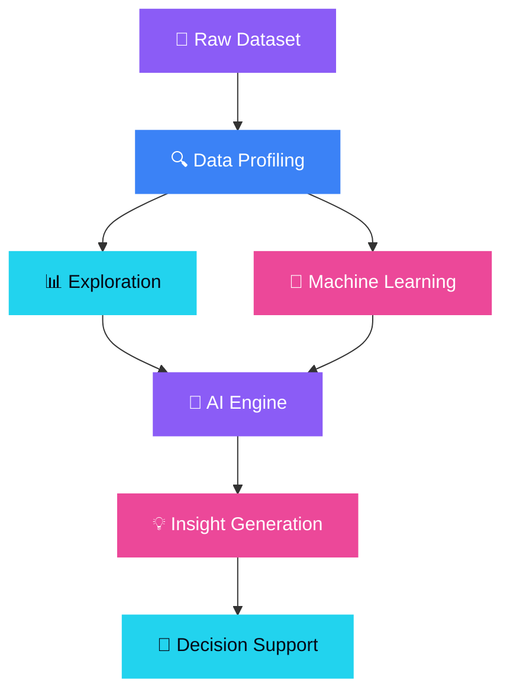
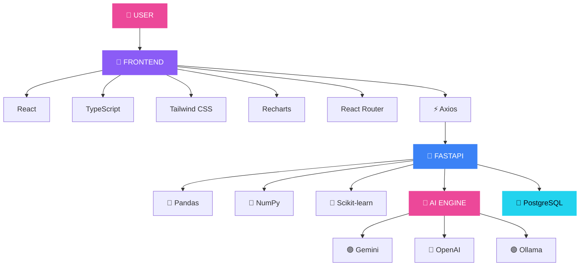

<div align="center">


<br/>

[](https://github.com/dhanush080607/DataPilot)
[](https://react.dev/)
[](https://www.typescriptlang.org/)
[](https://fastapi.tiangolo.com/)
[](https://www.python.org/)
[](https://www.postgresql.org/)

<br/>


</div>

---

<div align="center">

# ⚡ DATA → INTELLIGENCE

### `UPLOAD` → `PROFILE` → `EXPLORE` → `ASK` → `ANALYZE` → `UNDERSTAND`

</div>

```text
╭──────────────────────────────────────────────────────────────╮
│                                                              │
│                         YOUR DATA                            │
│                                                              │
╰──────────────────────────────┬───────────────────────────────╯
                               │
                               ▼
                    ┌─────────────────────┐
                    │   DATA PROFILING    │
                    │ Structure • Quality │
                    └──────────┬──────────┘
                               │
              ┌────────────────┼────────────────┐
              ▼                ▼                ▼
        📊 ANALYTICS      🤖 MACHINE       🧠 AI
                           LEARNING        INSIGHTS
              │                │                │
              └────────────────┼────────────────┘
                               ▼
                    ┌─────────────────────┐
                    │      DATAPILOT      │
                    │    INTELLIGENCE     │
                    └──────────┬──────────┘
                               │
                               ▼
                    ┌─────────────────────┐
                    │     DECISIONS       │
                    └─────────────────────┘
```

---

# 🧠 WHAT IS DATAPILOT?

**DataPilot** is an AI-powered data intelligence platform designed around one simple idea:

> ### Data analysis shouldn't stop at charts.

A dataset contains:

* Patterns
* Relationships
* Anomalies
* Trends
* Signals
* Opportunities

But discovering those signals traditionally requires moving between multiple tools.

```text
Jupyter
   +
Python
   +
Pandas
   +
Visualization
   +
Machine Learning
   +
AI Assistants
```

DataPilot brings these capabilities together into a unified workflow.

```text
       📂 UPLOAD
           ↓
       🔍 PROFILE
           ↓
       📊 EXPLORE
           ↓
       💬 ASK
           ↓
       ⚙️ ANALYZE
           ↓
       🤖 MODEL
           ↓
       🧠 UNDERSTAND
           ↓
       🎯 ACT
```

---

# 🌌 THE DATAPILOT EXPERIENCE

<div align="center">

### From raw tables → to meaningful intelligence

</div>

```text
                 ┌─────────────────┐
                 │      DATA       │
                 └────────┬────────┘
                          │
                          ▼
                 ┌─────────────────┐
                 │    PROFILING    │
                 └────────┬────────┘
                          │
              ┌───────────┼───────────┐
              ▼           ▼           ▼
           EXPLORE       ASK        MODEL
              │           │           │
              └───────────┼───────────┘
                          ▼
                 ┌─────────────────┐
                 │   AI ENGINE     │
                 └────────┬────────┘
                          │
                          ▼
                 ┌─────────────────┐
                 │    INSIGHTS     │
                 └────────┬────────┘
                          │
                          ▼
                 ┌─────────────────┐
                 │   DECISIONS     │
                 └─────────────────┘
```

---

# 🔥 WHY DATAPILOT?

## Traditional Data Analysis

```text
Dataset
   ↓
Write Python
   ↓
Clean Data
   ↓
Write More Python
   ↓
Create Charts
   ↓
Analyze
   ↓
Interpret
   ↓
Write Report
```

## DataPilot

```text
                    ┌───────────────┐
                    │    DATASET    │
                    └───────┬───────┘
                            ↓
                   ┌────────────────┐
                   │    DATAPILOT   │
                   └───────┬────────┘
                           ↓
              ┌────────────┼────────────┐
              ↓            ↓            ↓
           Explore       Ask AI       Build ML
              │            │            │
              └────────────┼────────────┘
                           ↓
                    🧠 INSIGHTS
                           ↓
                    🎯 DECISIONS
```

### The difference

| Traditional Workflow   | DataPilot                  |
| ---------------------- | -------------------------- |
| Multiple tools         | One workspace              |
| Manual profiling       | Automated profiling        |
| Write queries/code     | Ask questions              |
| Separate visualization | Integrated analytics       |
| Separate AI assistant  | AI-powered insights        |
| Manual interpretation  | AI-assisted interpretation |
| Manual workflow        | Guided intelligence        |

---

# ✨ FEATURE MATRIX

| Capability              | What it does                                         |
| ----------------------- | ---------------------------------------------------- |
| 📂 **Dataset Upload**   | Bring datasets directly into the workspace           |
| 🔍 **Auto Profiling**   | Understand structure, columns and data quality       |
| 📊 **Analytics**        | Explore patterns through interactive visualizations  |
| 🤖 **Machine Learning** | Build analytical and ML workflows                    |
| 🧠 **AI Insights**      | Turn analytical results into understandable insights |
| 💬 **Ask Your Data**    | Interact with datasets using natural language        |
| 📑 **Reports**          | Convert analysis into structured output              |

---

# 💬 ASK YOUR DATA

One of DataPilot's biggest ideas is removing the barrier between **human questions and data analysis**.

Instead of writing:

```python
df.groupby("region")["revenue"].mean()
```

the user should be able to ask:

> **"Which region has the highest average revenue?"**

DataPilot aims to transform:

```text
Human Question
       ↓
AI understands intent
       ↓
Data analysis
       ↓
Result
       ↓
Explanation
```

This moves DataPilot from being just another dashboard toward an **AI data copilot**.

---

# 🧠 AI ENGINE

DataPilot is designed around a multi-provider AI architecture.

```text
                       ┌───────────────┐
                       │   DATAPILOT   │
                       └───────┬───────┘
                               │
                ┌──────────────┼──────────────┐
                ▼              ▼              ▼
            🟣 GEMINI       🔵 OPENAI      🟢 OLLAMA
                │              │              │
                └──────────────┼──────────────┘
                               ▼
                      ┌────────────────┐
                      │   AI ENGINE    │
                      └───────┬────────┘
                              ↓
                       🧠 INSIGHTS
```

### AI capabilities

* 💬 Natural-language questions
* 🧠 Insight generation
* 📊 Analytical explanations
* 🔎 Data interpretation
* 🎯 Recommendations
* 🤖 AI-assisted exploration
* 📈 Result interpretation

---

# 📊 DATA INTELLIGENCE PIPELINE



---

# 🎨 THE EXPERIENCE

DataPilot is designed to feel different from a traditional data-science dashboard.

The visual direction:

```text
              DARK INTERFACE
                    +
              GLASS SURFACES
                    +
          VIOLET / BLUE / MAGENTA
                    +
              CYAN ACCENTS
                    +
             DATA VISUALS
                    +
            MICRO MOTIONS
                    +
              AI EFFECTS
                    ↓
          PREMIUM EXPERIENCE
```

### Visual language

🟣 **Violet** → AI / Intelligence
🔵 **Blue** → Data / Technology
🩷 **Magenta** → Insights / Creativity
🟢 **Cyan** → Actions / Results

### Planned visual layer

* ✨ Smooth page transitions
* 🎴 Animated data cards
* 🌊 Staggered dashboard reveals
* 📊 Interactive charts
* 🤖 AI loading states
* 🖱️ Hover micro-interactions
* 🔢 Animated counters
* 🔗 Data-flow animations
* ✨ Subtle particle effects
* 🌌 Three-dimensional AI/data visuals

> The visual effects should enhance the analytical experience — not compete with the data.

---

# 🌌 THREE.JS — THE DATA UNIVERSE

DataPilot can evolve beyond traditional dashboard visuals.

Imagine entering the application and seeing:

```text
                       ✦
                 ·           ·

             ·        ◉        ·
                  ╲   │   ╱

        ─────────── DATA ───────────

                  ╱   │   ╲
             ·        │        ·

                 ·    │    ·
                       ✦
```

Three.js can eventually power:

* 🌌 Interactive AI backgrounds
* 🕸️ Data-node networks
* ✨ Particle fields
* 🔗 3D data relationships
* 📊 Dataset visualization
* 🌐 Interactive hero environments

### Design principle

> **3D should explain the product, not distract from it.**

---

# 🌀 MOTION SYSTEM

DataPilot's future motion layer can use **Anime.js** for intentional micro-interactions.

### Page entrance

```text
Header
   ↓
Hero
   ↓
Stats
   ↓
Charts
   ↓
Insights
```

with staggered reveals.

### Data loading

```text
██████████████░░░░░░  72%
```

with smooth transitions.

### Insight generation

```text
Analyzing
   ●
   ● ●
   ● ● ●
      ↓
Insight Ready ✨
```

### Dashboard

Cards, metrics and charts can enter progressively instead of appearing instantly.

---

# 🏗️ ARCHITECTURE



---

# 🛠️ TECH STACK

<div align="center">

### 🎨 FRONTEND


### ⚙️ BACKEND


### 🗄️ DATABASE


### 🧠 AI / DATA

```text
🟣 Google Gemini
🔵 OpenAI
🟢 Ollama

🐼 Pandas
🔢 NumPy
🤖 Scikit-learn
📊 Recharts
```

</div>

---

# 📂 PROJECT STRUCTURE

```text
DataPilot/
│
├── 🐍 backend/
│   │
│   ├── app/
│   │   ├── api/
│   │   ├── core/
│   │   ├── schemas/
│   │   ├── services/
│   │   ├── utils/
│   │   └── main.py
│   │
│   ├── requirements.txt
│   ├── test_gemini.py
│   ├── test_insights.py
│   └── test_profiler.py
│
├── ⚛️ frontend/
│   │
│   ├── public/
│   ├── src/
│   ├── package.json
│   ├── vite.config.ts
│   └── tsconfig.json
│
├── 📜 LICENSE
└── 📖 README.md
```

---

# ⚙️ QUICK START

## 01 — Clone

```bash
git clone https://github.com/dhanush080607/DataPilot.git

cd DataPilot
```

---

## 02 — Backend

```bash
cd backend

python -m venv .venv
```

### Windows

```bash
.venv\Scripts\activate
```

### macOS / Linux

```bash
source .venv/bin/activate
```

Install dependencies:

```bash
pip install -r requirements.txt
```

---

## 03 — Environment

Create your environment configuration.

```env
DATABASE_URL=your_postgresql_url

GEMINI_API_KEY=your_gemini_key

OPENAI_API_KEY=your_openai_key
```

Only configure the providers you intend to use.

> 🔐 **Never commit secrets to GitHub.**

---

## 04 — Run Backend

```bash
uvicorn app.main:app --reload
```

---

## 05 — Run Frontend

Open another terminal:

```bash
cd frontend

npm install

npm run dev
```

Then open the local development URL shown by Vite.

---

# 🧪 DEVELOPMENT

## Frontend

```bash
npm run dev
npm run build
npm run lint
npm run preview
```

## Backend

```bash
uvicorn app.main:app --reload
```

## Tests

```bash
python test_gemini.py
python test_insights.py
python test_profiler.py
```

---

# 📈 ROADMAP

```text
                         DATAPILOT
                            │
                            ▼
              ┌────────────────────────┐
              │      FOUNDATION        │
              │ Upload • Profiling     │
              │ Analytics • API        │
              └───────────┬────────────┘
                          │
                          ▼
              ┌────────────────────────┐
              │     INTELLIGENCE       │
              │ AI • Ask Data          │
              │ Insights               │
              └───────────┬────────────┘
                          │
                          ▼
              ┌────────────────────────┐
              │     VISUALIZATION      │
              │ Charts • Motion • 3D   │
              └───────────┬────────────┘
                          │
                          ▼
              ┌────────────────────────┐
              │       AUTOMATION       │
              │ AI Workflows • ML      │
              └───────────┬────────────┘
                          │
                          ▼
              ┌────────────────────────┐
              │       PRODUCTION       │
              │ Scale • Security       │
              │ Cloud • Testing        │
              └────────────────────────┘
```

---

## 🟢 COMPLETED

* [x] React frontend
* [x] TypeScript
* [x] FastAPI backend
* [x] Dataset upload foundation
* [x] Dataset profiling
* [x] Analytics foundation
* [x] Machine-learning foundation
* [x] AI provider integration
* [x] PostgreSQL foundation
* [x] AI insights foundation

---

## 🟡 IN PROGRESS

* [ ] Advanced AI data interaction
* [ ] Better insight generation
* [ ] Advanced analytical workflows
* [ ] Improved dashboard experience
* [ ] Production hardening

---

## 🔵 NEXT

* [ ] Advanced Anime.js motion system
* [ ] Three.js data / AI visual layer
* [ ] Advanced report generation
* [ ] Improved ML automation
* [ ] Performance optimization
* [ ] Comprehensive testing
* [ ] Production deployment

---

# 🔐 SECURITY

Never expose:

```text
❌ API Keys
❌ Database passwords
❌ .env files
❌ Authentication secrets
❌ Private credentials
```

Use:

```text
Environment Variables
        ↓
     Backend
        ↓
 ┌──────┴──────┐
 ↓             ↓
AI          Database
```

### Security principles

* 🔒 Keep secrets in environment variables
* 🚫 Never commit `.env`
* 🔑 Rotate exposed API keys
* 🛡️ Validate uploaded files
* 🧹 Sanitize user inputs
* 📦 Keep dependencies updated

---

# 🤝 CONTRIBUTING

Want to improve DataPilot?

```text
⭐ Star
  ↓
🍴 Fork
  ↓
🌿 Branch
  ↓
💻 Code
  ↓
🧪 Test
  ↓
📤 Push
  ↓
🔀 Pull Request
```

### Contribution flow

1. Fork the repository
2. Create a feature branch
3. Make your changes
4. Test the changes
5. Commit your work
6. Push the branch
7. Open a Pull Request

Ideas, improvements and bug reports are welcome.

---

# 🧭 PRODUCT PHILOSOPHY

DataPilot is built around four principles:

```text
              ┌───────────────┐
              │      DATA     │
              └───────┬───────┘
                      ↓
              ┌───────────────┐
              │   CLARITY     │
              └───────┬───────┘
                      ↓
              ┌───────────────┐
              │ INTELLIGENCE  │
              └───────┬───────┘
                      ↓
              ┌───────────────┐
              │    ACTION     │
              └───────────────┘
```

### Data

Understand what exists.

### Clarity

Make complex datasets understandable.

### Intelligence

Use analytics, ML and AI to uncover patterns.

### Action

Turn insights into meaningful decisions.

---

# 🌟 THE VISION

DataPilot is being built around a larger question:

> ### What if interacting with data felt as natural as talking to an expert?

Instead of asking users to understand every analytical operation first, DataPilot aims to let users start with the question.

```text
"I want to understand my dataset."
                ↓
"What's unusual here?"
                ↓
"Why is this happening?"
                ↓
"What should I investigate?"
                ↓
"What model should I try?"
                ↓
"What does the result mean?"
```

The goal is to transform those questions into:

```text
             QUESTIONS
                 ↓
              ANALYSIS
                 ↓
              INSIGHTS
                 ↓
             EXPLANATION
                 ↓
              DECISIONS
```

---

# 🚀 DATAPILOT IN ONE SENTENCE

<div align="center">

### **DataPilot turns raw datasets into understandable, AI-assisted intelligence.**

</div>

---

# 👨‍💻 BUILT BY

<p align="center">


<br/>
<div align="center">

## Dhanush

**CSE — Data Science**

`AI` • `Data Science` • `Machine Learning` • `Full-Stack Development`

<br/>

<a href="https://github.com/dhanush080607">

</a>

</div>

---

# ⭐ SUPPORT DATAPILOT

If you like the project:

⭐ **Star the repository**

🐛 **Report a bug**

💡 **Suggest an idea**

🤝 **Contribute**

🚀 **Help build the future of AI-powered data analysis**

---

<div align="center">

### ⚡ DATAPILOT

**Explore. Ask. Analyze. Understand.**

<br/>


</div>
